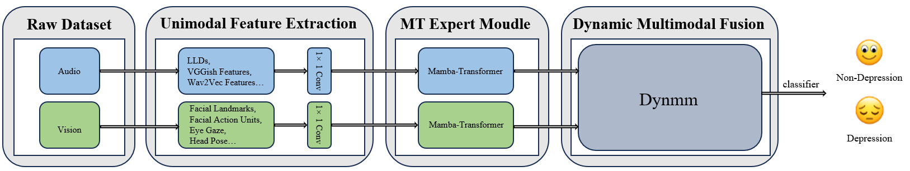

# DynMultiDep: Dynamic Multi-modal Dependency for Depression Detection

This repository contains the implementation of **DynMultiDep** (Dynamic Multi-modal Dependency), a state-of-the-art model for multi-modal depression detection using audio and visual cues.

<div align="center">
    
</div>

## Overview

DynMultiDep is a cross-modal fusion framework designed for effective depression detection from multi-modal inputs (audio and video). The model employs an innovative dynamic weighting mechanism that adaptively balances the contribution of each modality during inference.

The architecture consists of four main components as shown in the diagram:

1. **Raw Dataset**: Audio and visual inputs from the D-Vlog and LMVD datasets.
2. **Unimodal Feature Extraction**: Extraction of modality-specific features such as LLDs and VGGish features for audio, and facial landmarks, action units, eye gaze, and head pose features for video.
3. **MT Expert Module**: Mamba-Transformer encoders that process each modality separately.
4. **Dynamic Multimodal Fusion**: The DynMM module that dynamically fuses modalities with adaptive weighting before classification.

## Key Features

- **Dynamic Modality Weighting**: Adaptively assigns importance to audio and visual modalities based on input content
- **Mamba-based Sequence Modeling**: Utilizes state space models (Mamba) for efficient sequence processing
- **Cross-modal Information Sharing**: Enables information flow between modalities
- **Flexible Architecture**: Supports different input feature types and dimensions

## Installation

### Requirements

- Python 3.8+
- PyTorch 2.0+
- CUDA 11.7+ (for GPU acceleration)

### Setup

Clone the repository:

```bash
git clone https://github.com/yourusername/DynMultiDep.git
cd DynMultiDep
```

Install dependencies:

```bash
# Create environment
conda create -n dynmultidep python=3.8
conda activate dynmultidep

# Install PyTorch
conda install pytorch==2.0.1 torchvision==0.15.2 torchaudio==2.0.2 pytorch-cuda=11.7 -c pytorch -c nvidia

# Install Mamba SSM
git clone https://github.com/state-spaces/mamba.git
cd mamba
pip install -e .
cd ..

# Install other requirements
pip install -r requirements.txt
```

## Dataset Preparation

This model supports two depression detection datasets:

### D-Vlog Dataset

1. Request access to the dataset from the [D-Vlog website](https://sites.google.com/view/jeewoo-yoon/dataset)
2. Extract the features and place them in the configured `data_dir` path
3. Use LLDs for audio features (25-dim) and facial landmarks for visual features (136-dim)

### LMVD Dataset

1. Download LMVD dataset features from official sources
2. Run preprocessing: `python extract_npy_lmvd.py`
3. Use VGGish for audio features (128-dim) and facial features (136-dim)

## Training

To train the model on D-Vlog dataset:

```bash
python main.py --train True \
               --train_gender both \
               --test_gender both \
               --epochs 120 \
               --batch_size 32 \
               --learning_rate 5e-4 \
               --model DynMultiDep \
               --dataset dvlog \
               --gpu 0
```

To train on LMVD dataset:

```bash
python main.py --train True \
               --train_gender both \
               --test_gender both \
               --epochs 120 \
               --batch_size 32 \
               --learning_rate 5e-4 \
               --model DynMultiDep \
               --dataset lmvd \
               --gpu 0
```

## Evaluation

To evaluate the trained model:

```bash
python main.py --train False \
               --test_gender both \
               --model DynMultiDep \
               --dataset dvlog \
               --gpu 0
```

## Configuration

The model configuration is defined in `config/config.yaml`. Key parameters include:

- **Dataset parameters**: `dataset`, `train_gender`, `test_gender`
- **Training parameters**: `epochs`, `batch_size`, `learning_rate`
- **Model parameters**: 
  - `mamba_config`: Controls the Mamba SSM behavior (`d_state`, `expand`, `d_conv`, `bidirectional`)
  - `audio_input_size` and `video_input_size`: Input feature dimensions
  - `mm_output_sizes`: Encoder output dimensions
  - `num_layers`: Number of encoder layers
  - `temp` and `hard_gate`: Control the modality fusion behavior

## Project Structure

```
DynMultiDep/
├── config/                 # Configuration files
├── datasets/               # Dataset loaders
│   ├── dvlog/              # D-Vlog dataset utilities
│   └── lmvd/               # LMVD dataset utilities
├── models/                 # Model definitions
│   ├── base_model.py       # Base model class
│   ├── dyn_multi_dep.py    # Main model implementation
│   ├── encoders/           # Encoder models
│   ├── layers/             # Model layer definitions
│   └── mamba_ssm/          # Mamba SSM implementation
├── utils/                  # Utility functions
├── results/                # Output results
├── main.py                 # Main entry point
└── requirements.txt        # Dependencies
```

## Results

DynMultiDep achieves state-of-the-art performance on depression detection:

- **D-Vlog**: High accuracy and F1 scores in cross-gender evaluations
- **LMVD**: Strong performance across different demographic groups

Detailed results are saved to the `results/` directory after each run.

## Monitoring

The training process can be monitored using Weights & Biases:

```bash
# First login to W&B
wandb login

# Then run training with W&B enabled
python main.py --if_wandb True --model DynMultiDep --dataset dvlog
```

## License

This project is released under the MIT License.


## Acknowledgements

- We thank the authors of Mamba for their excellent state space model implementation
- The implementation of bidirectional Mamba is adapted from the Vision Mamba project
- The training pipeline is inspired by SpeechBrain 